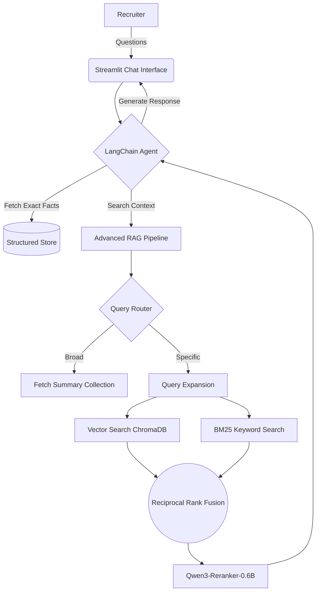

<div align="center">

# 🤖 AI Candidate Agent

**An AI-powered digital avatar designed to represent you to recruiters 24/7.**

<p align="center">
  
  
  
  
  
  
  <a href="https://github.com/astral-sh/ruff"></a>
</p>

</div>

---

## 📖 Overview

The **AI Candidate Agent** is a conversational AI representative that answers technical, behavioral, and logistical questions about a candidate's profile on their behalf.

Moving beyond standard "Chat with PDF" retrieval, it combines an **Agentic ReAct architecture** with an **Advanced RAG Pipeline**. The agent intelligently routes between querying structured verified facts and executing hybrid search over unstructured documents, delivering accurate, grounded, and context-aware responses — all running on **local open-source models** with zero external API costs.

### 🛠️ Tech Stack
| Layer | Technologies |
|-------|-------------|
| **LLM & Embeddings** | Ollama (Qwen3), Nomic embeddings, `sentence-transformers` |
| **Retrieval** | ChromaDB (dense), BM25 Okapi (sparse), Reciprocal Rank Fusion, Qwen3-Reranker |
| **Agent & Orchestration** | LangChain, ReAct-style tool calling |
| **Ingestion** | `unstructured`, PyMuPDF, section-aware chunking |
| **Evaluation** | RAGAS, DeepEval (GEval), custom retrieval-gate analysis |
| **Frontend** | Streamlit |

---

## ✨ Key Features

### 🕵️‍♂️ Agentic Tool Calling
The system doesn't blindly query a vector database. It utilizes an LLM agent with multiple tools at its disposal:
* `get_structured_data`: Retrieves verified, hard facts (salary expectations, availability, specific degree names) from a structured JSON store.
* `search_documents`: Executes the RAG pipeline over unstructured data (CVs, cover letters, certificates).
* **Multi-Step Fallbacks:** The agent is capable of chaining tools — if the structured data returns a short summary, the agent will dynamically follow up with a semantic document search to gather richer detail.

### 🧠 Advanced RAG Pipeline
The document engine (`rag/ingest.py` and `rag/retriever.py`) implements advanced ingestion and search techniques:
* **Intelligent Ingestion & Chunking:** Uses `unstructured` to parse diverse formats (PDF, DOCX) while intelligently grouping text by logical document sections. It detects complex headers and prepends the section title to each chunk to guarantee semantic richness.
* **Dual-Index Generation:** During ingestion, an LLM automatically generates a factual 5-6 sentence summary of every document. This is stored in a separate summary index to handle broad conversational queries.
* **Query Routing:** Dynamically classifies queries as `BROAD` (fetching the pre-computed candidate summaries) or `SPECIFIC` (triggering deep search).
* **Query Expansion:** Uses an LLM to generate multiple semantic variations of the user's query to maximize recall.
* **Hybrid Search & RRF:** Combines dense semantic vector search (ChromaDB + SentenceTransformers) with sparse keyword search (BM25 Okapi) using **Reciprocal Rank Fusion**.
* **Instruction-Tuned Re-ranking:** Re-scores the fused candidate pool with `Qwen3-Reranker-0.6B`. Rather than a classification-head cross-encoder, it wraps each (query, chunk) pair in an instruction prompt and reads the relevance score from the model's `yes`/`no` token probability — the scoring method the model was actually trained for — returning the top-8 most relevant chunks to maximize context quality.

### 📊 Automated Evaluation Suite
Built with **RAGAS** and **DeepEval (GEval)**, the `evaluation/` module rigorously benchmarks the agent across 7 components:

| Component | What it measures |
|-----------|-----------------|
| **Tool Selection** | Whether the agent picks the right tool for each question |
| **RAG Quality (RAGAS)** | Faithfulness, answer relevancy, context precision & recall |
| **Retrieval Gate Localization** | Where retrieval fails: ingestion vs. recall vs. re-rank |
| **Answer Correctness (GEval)** | LLM-as-judge scoring of factual correctness vs. ground truth |
| **Refusal Accuracy** | Correct handling of out-of-scope and sensitive questions |
| **Ingestion Quality** | Chunk coverage, section detection, summary quality |
| **Router Accuracy** | Broad vs. specific query classification |

**Current Results** *(6 candidates · 426 questions · 23.7s avg latency)*:

| Metric | Score |
|--------|-------|
| Tool Selection Accuracy | **91.1%** |
| Refusal Accuracy | **96.5%** |
| Router Accuracy | **82.4%** |
| Retrieval Reaches Answer | **86.7%** |
| RAG — Faithfulness | **91.3%** |
| RAG — Answer Relevancy | **87.8%** |
| RAG — Context Recall | **76.6%** |
| RAG — Context Precision | **76.8%** |
| Answer Correctness (GEval) | **79.1%** |

A standout feature of the suite is **retrieval gate localization**, which traces each failed query to the exact stage it broke down — ingestion, recall, or re-ranking. This pinpointed the re-ranker as the primary bottleneck and informed a targeted upgrade to `Qwen3-Reranker-0.6B`, rather than guessing from an aggregate recall score.

### 💻 Candidate Setup Dashboard
A sleek Streamlit interface where the candidate can easily input verified structured facts and upload unstructured PDFs/Docs for automatic chunking and ingestion.

<p align="center">
  
</p>

### 💬 Recruiter Chat Interface
Recruiters interact with the AI agent through a clean conversational UI, asking questions about the candidate's background, skills, and availability — all answered in real-time by the agentic pipeline.

<p align="center">
  
</p>

---

## 🏗️ Architecture Overview



---

## 🚀 Getting Started

### Prerequisites
1. Ensure you have **Python 3.10+** installed.
2. Install [uv](https://docs.astral.sh/uv/getting-started/installation/) (fast Python package manager).
3. Install and run [Ollama](https://ollama.ai/).
4. Pull the required models:
   ```bash
   ollama pull qwen3
   ```

### Installation
1. Clone the repository and navigate to the project directory:
   ```bash
   git clone <your-repo-url>
   cd ai-candidate-agent
   ```
2. Install all dependencies (creates a venv automatically):
   ```bash
   uv sync --all-groups
   ```

### Running the App Locally
Start the Streamlit application:
```bash
uv run streamlit run main.py
```
1. **Candidate Setup (`/setup`):** Fill in your verified details and upload your CV/documents.
2. **Recruiter Chat (`/recruiter`):** Share the link with recruiters so they can chat with your personalized AI agent!

### 🐳 Docker Deployment
A highly optimized, multi-stage `Dockerfile` is included for production deployment (e.g. on RunPod). It automatically installs `uv`, system dependencies (Tesseract), and only your production Python packages.

```bash
# Build the image
docker build -t candidate-agent .

# Run the container (exposes port 3000)
docker run -p 3000:3000 candidate-agent
```
> **Note:** The agent requires access to Ollama. If running in Docker on a pod, ensure Ollama is accessible from within the container (e.g. running on the host network or via a Docker network).

---

## 🛠️ Development

This project uses [**Ruff**](https://docs.astral.sh/ruff/) for linting and formatting.

```bash
# Lint (check for issues)
uv run ruff check .

# Lint (auto-fix)
uv run ruff check . --fix

# Format code
uv run ruff format .

# Format check (dry run)
uv run ruff format . --check

# Run tests
uv run pytest
```

---
