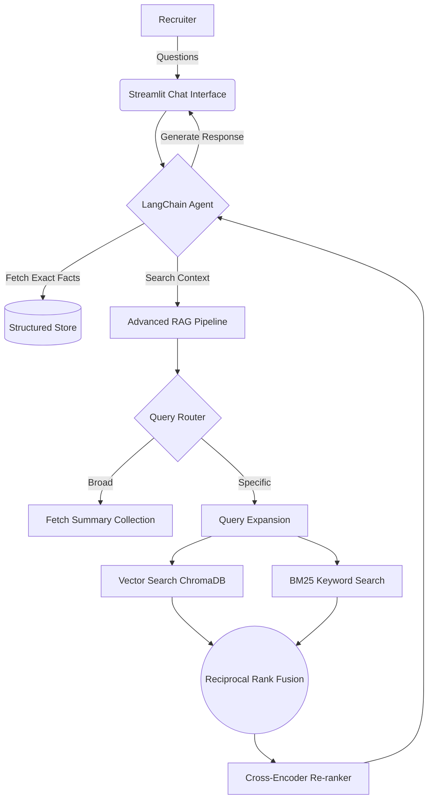

<div align="center">

# 🤖 Candidate Representor Agent

**An AI-powered digital avatar designed to represent YOU to recruiters 24/7.**

<p align="center">
  
  
  
  
  
</p>

</div>

---

## 📖 Overview

The **Candidate Representor Agent** is an enterprise-grade LLM system engineered to serve as a personalized, conversational representative. Moving beyond standard retrieval systems, it leverages **Agentic ReAct paradigms**, an **Advanced Retrieval-Augmented Generation (RAG) Pipeline**, and a rigorous **Automated Evaluation Framework** to ensure high-fidelity, hallucination-free responses.

Designed for maximum accuracy and context-awareness, the agent dynamically navigates both structured verified facts and complex unstructured documentation. This allows it to answer deep technical, behavioral, and logistical questions seamlessly and professionally.

---

## ✨ Key Features

### 🕵️‍♂️ Agentic Tool Calling
The system doesn't blindly query a vector database. It utilizes an LLM agent with multiple tools at its disposal:
* `get_structured_data`: Retrieves verified, hard facts (salary expectations, availability, specific degree names) from a structured JSON store.
* `search_documents`: Executes the RAG pipeline over unstructured data (CVs, cover letters, certificates).
* **Multi-Step Fallbacks:** The agent is capable of chaining tools—if the structured data returns a short summary, the agent will dynamically follow up with a semantic document search to gather richer detail.

### 🧠 Advanced RAG Pipeline
The document engine (`rag/ingest.py` and `rag/retriever.py`) implements state-of-the-art ingestion and search techniques:
* **Intelligent Ingestion & Chunking:** Uses `unstructured` to parse diverse formats (PDF, DOCX) while intelligently grouping text by logical document sections. It detects complex headers and prepends the section title to each chunk to guarantee semantic richness.
* **Dual-Index Generation:** During ingestion, an LLM automatically generates a factual 5-6 sentence summary of every document. This is stored in a separate summary index to handle broad conversational queries.
* **Query Routing:** Dynamically classifies queries as `BROAD` (fetching the pre-computed candidate summaries) or `SPECIFIC` (triggering deep search).
* **Query Expansion:** Uses an LLM to generate multiple semantic variations of the user's query to maximize recall.
* **Hybrid Search & RRF:** Combines dense semantic vector search (ChromaDB + SentenceTransformers) with sparse keyword search (BM25 Okapi) using **Reciprocal Rank Fusion**.
* **Cross-Encoder Re-ranking:** Re-scores the retrieved chunks using `ms-marco-MiniLM` to ensure the final context injected into the prompt has maximum relevance.

### 📊 Automated Evaluation Suite
Built with **Ragas** and **DeepEval**, the `evaluation/` module rigorously benchmarks the agent against test datasets to measure context precision, hallucination rates, and tool selection accuracy.

**Latest Evaluation Results:**
| Metric | Score | Description |
|--------|-------|-------------|
| **Tool Selection Accuracy** | **93.7%** | The agent's ability to correctly choose between structured data and document search. |
| **Faithfulness (Ragas)** | **88.8%** | Measures how factually accurate the generated answer is based on the retrieved context. |
| **Router Accuracy** | **86.1%** | The system's accuracy in routing queries to `BROAD` (summaries) vs `SPECIFIC` (hybrid search). |
| **Answer Relevancy (Ragas)** | **77.1%** | How relevant the generated answer is to the original user query. |
| **Context Recall (Ragas)** | **63.5%** | Evaluates if the retrieved chunks contain all the necessary information to answer the query. |
| **Hallucination Rate (DeepEval)** | **25.6%** | The percentage of responses containing fabricated information (lower is better). |

### 💻 Candidate Setup Dashboard
A sleek Streamlit interface where the candidate can easily input verified structured facts and upload unstructured PDFs/Docs for automatic chunking and ingestion.

---

## 🏗️ Architecture Overview



---

## 🚀 Getting Started

### Prerequisites
1. Ensure you have **Python 3.10+** installed.
2. Install and run [Ollama](https://ollama.ai/).
3. Pull the required models:
   ```bash
   ollama pull qwen3  # Or the model configured in your environment
   ```

### Installation
1. Clone the repository and navigate to the project directory:
   ```bash
   git clone <your-repo-url>
   cd candidate_representor_agent
   ```
2. Set up your virtual environment and install dependencies:
   ```bash
   python -m venv .venv
   source .venv/bin/activate  # On Windows: .venv\Scripts\activate
   pip install -r requirements.txt
   ```

### Running the App
Start the Streamlit application:
```bash
streamlit run main.py
```
1. **Candidate Setup (`/setup`):** Fill in your verified details and upload your CV/documents.
2. **Recruiter Chat (`/recruiter`):** Share the link with recruiters so they can chat with your personalized AI agent!

---


